# Лабораторная работа 1. Работа с сокетами

**Студент:** Ипатова Ульяна  
**Группа:** К3339  
**Дисциплина:** Веб-программирование

## Цель работы

Реализовать клиентские и серверные программы на Python с использованием библиотеки `socket`: обмен сообщениями по UDP, вычисления по TCP, передачу HTML-страницы, чат и обработку GET/POST-запросов.

## Задание 1. Обмен сообщениями по UDP

**Файлы:** `task_1_udp/server_UDP.py`, `task_1_udp/client_UDP.py`.

Клиент создаёт UDP-сокет и отправляет серверу строку `Hello server!` с помощью `sendto()`. Сервер принимает её через `recvfrom()`, выводит на экран и отправляет ответ `Hello client!`. Клиент получает и выводит ответ. В программе используется адрес `localhost` и порт `8080`.

Фрагмент из сервера:

```python
server_socket = socket.socket(socket.AF_INET, socket.SOCK_DGRAM)
server_socket.bind(('localhost', 8080))
data, client_address = server_socket.recvfrom(1024)
request = data.decode()
print(request)
server_socket.sendto("Hello client!".encode(), client_address)
```

**Запуск:** в папке `task_1_udp` сначала выполнить `python server_UDP.py`, затем в другом терминале `python client_UDP.py`.

**Ожидаемый результат:** сервер выводит `Hello server!`, клиент выводит `Hello client!`.

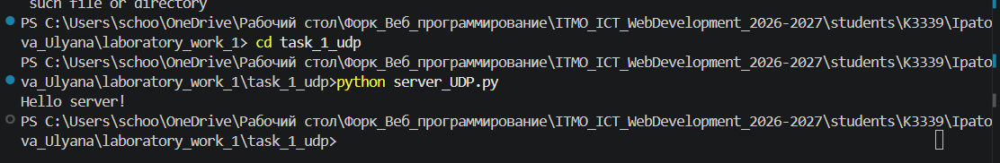
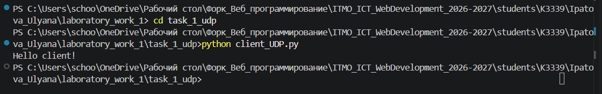

## Задание 2. Вычисления через TCP

**Файлы:** `task_2_tcp/server_TCP.py`, `task_2_tcp/client_TCP.py`.

Вариант 2: решение квадратного уравнения `ax² + bx + c = 0`. Клиент устанавливает TCP-соединение через `connect()`, предлагает ввести три коэффициента через пробел и передаёт введённую строку серверу. Сервер получает её методом `recv()`, разделяет на три значения и вычисляет дискриминант `D = b² - 4ac`.

При `a = 0` сервер отправляет сообщение `Это не квадратное уравнение`. При положительном дискриминанте вычисляет два корня, при нулевом - один; при отрицательном отправляет `Нет корней!`. Ответ приходит клиенту и выводится в терминале.

Фрагмент из сервера:

```python
a, b, c = parameters.split()
if float(a) == 0:
    client_connection.sendall("Это не квадратное уравнение".encode())
    client_connection.close()
    continue
discriminant = float(b)**2 - 4 * float(a) * float(c)
```

**Запуск:** в папке `task_2_tcp` сначала выполнить `python server_TCP.py`, затем в другом терминале `python client_TCP.py`. Для проверки можно ввести `1 -3 2` (корни 2 и 1), `1 2 1` (корень -1), `1 0 1` (сообщение об отсутствии корней).

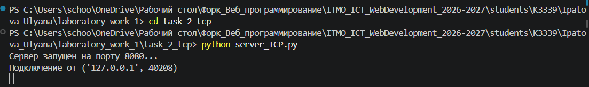
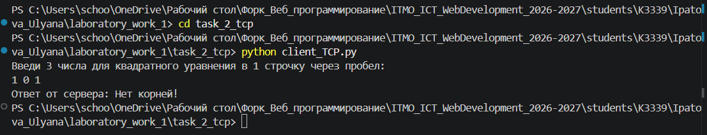

## Задание 3. Раздача HTML-страницы по HTTP

**Файлы:** `task_3_http/server_HTTP.py`, `task_3_http/index.html`.

Сервер создаёт TCP-сокет, принимает подключение браузера, читает HTML-страницу из файла `index.html` и отправляет HTTP-ответ. В ответе указаны статус `200 OK`, тип содержимого `text/html`, длина HTML в байтах (`Content-Length`) и заголовок `Connection: close`. Затем передаётся содержимое файла.

Фрагмент из сервера:

```python
with open("index.html", "r", encoding="utf-8") as file:
    html = file.read()
html_response = html.encode()
http_headers = (
    "HTTP/1.1 200 OK\r\n"
    "Content-Type: text/html; charset=UTF-8\r\n"
    f"Content-Length: {len(html_response)}\r\n"
    "Connection: close\r\n"
    "\r\n"
).encode()
```

**Запуск:** открыть терминал в папке `task_3_http`, выполнить `python server_HTTP.py`, затем перейти в браузере по адресу `http://localhost:8080/`. Файл `index.html` должен находиться в этой же папке.

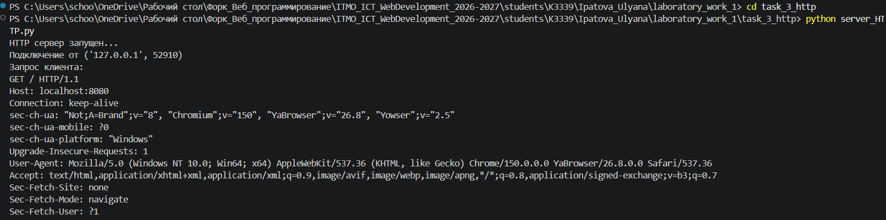
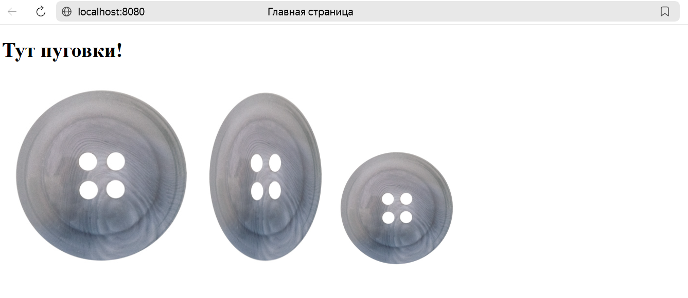

## Задание 4. Чат на сокетах

**Файлы:** `task_4_chat/server_chat.py`, `task_4_chat/client_chat.py`.

Чат работает по TCP. При запуске клиент запрашивает имя пользователя и передаёт его серверу. Сервер хранит подключённых пользователей в словаре `clients`: ключ - сокет, значение - имя. Для каждого клиента сервер создаёт отдельный поток с помощью `threading.Thread()`. Полученные сообщения сервер пересылает остальным участникам через `broadcast()`.

На клиенте отдельный поток принимает сообщения, а основной поток считывает ввод с клавиатуры. Для выхода используется команда `/покинуть группу/`.

Фрагмент из сервера:

```python
clients = {}

while True:
    client_socket, client_address = server_socket.accept()
    thread = threading.Thread(
        target=handle_client,
        args=(client_socket, client_address)
    )
    thread.start()
```

**Запуск:** в папке `task_4_chat` выполнить `python server_chat.py`. Затем в двух или трёх других терминалах выполнить одну и ту же команду `python client_chat.py`. В каждом клиенте ввести своё имя, отправить сообщения и проверить выход командой `/покинуть группу/`.

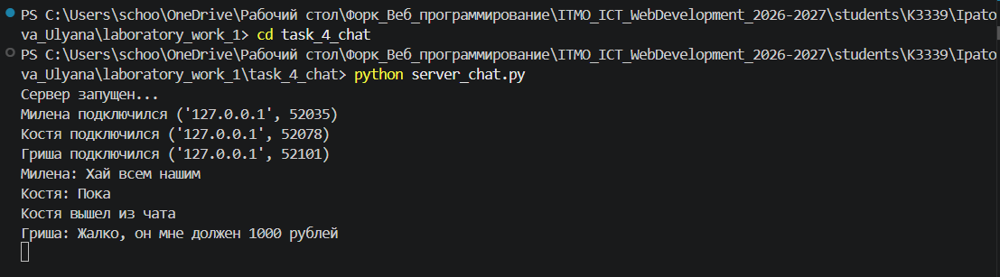
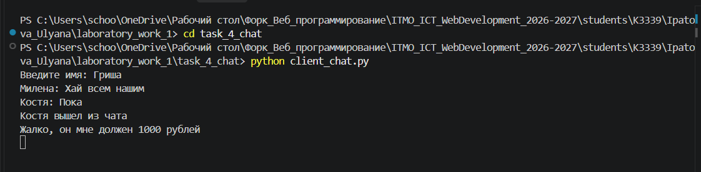
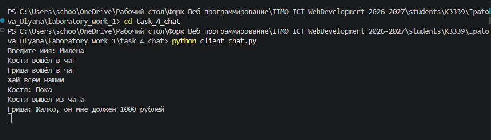
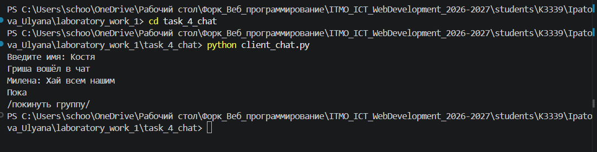

## Задание 5. Простой веб-сервер GET/POST

**Файл:** `task_5_web/server_WEB.py`.

Сервер принимает HTTP-запросы через TCP-сокет. Функция `receive_request()` считывает заголовки и тело запроса, `parse_request()` определяет метод и путь. При `GET /` формируется страница с журналом оценок и формой. При `POST /grade` сервер получает название дисциплины и оценку из формы, после чего снова выводит страницу.

Оценки хранятся в словаре `grades`: названием дисциплины служит ключ, а значением - список её оценок. Поэтому при добавлении двух оценок по одному предмету создаётся одна запись с двумя оценками, а не две отдельные записи.

Фрагмент из сервера:

```python
grades = {}

if subject not in grades:
    grades[subject] = []

grades[subject].append(grade)
```

| Метод | Путь | Действие |
| --- | --- | --- |
| GET | `/` | Показать журнал и форму добавления оценки |
| POST | `/grade` | Принять данные формы и добавить оценку |

Форма содержит поле дисциплины и поле оценки от 2 до 5. В коде сервера есть проверка пустого названия, проверка `subject.isdigit()` и проверка диапазона оценки. Функция `add_grade()` возвращает текст ошибки при неверных данных, но текущая функция `handle_client()` этот текст не показывает на HTML-странице.

**Запуск:** в папке `task_5_web` выполнить `python server_WEB.py`, затем открыть `http://localhost:8080/` и добавить несколько оценок. Например, после добавления оценок 5 и 4 по математике в журнале должна отображаться запись `Математика: [5, 4]`. Данные находятся в памяти и пропадают после перезапуска сервера.

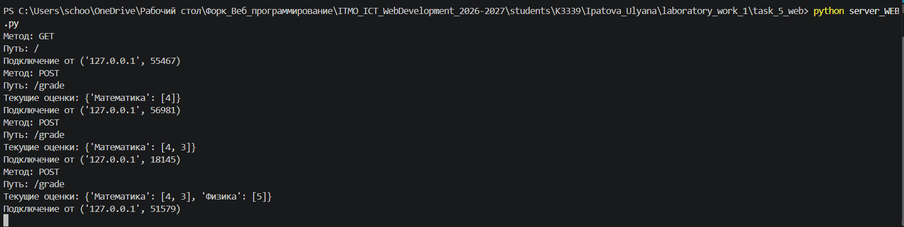
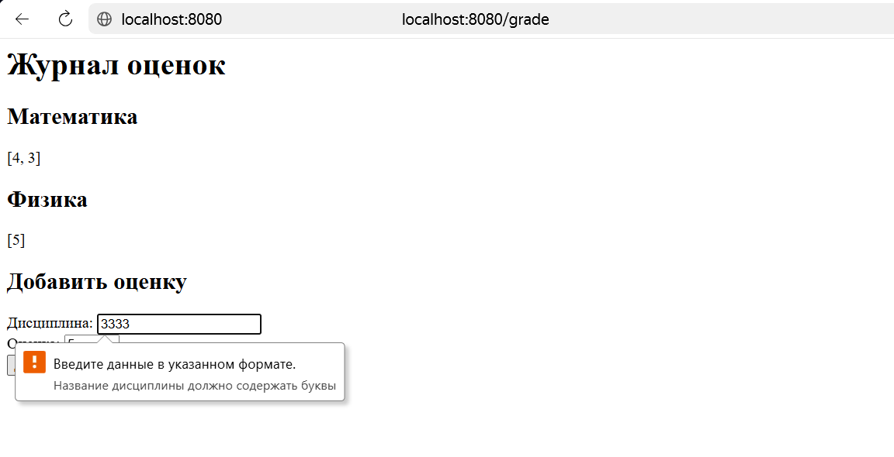

## Вывод

В ходе работы написаны пять программ с использованием сокетов. В первых трёх заданиях реализованы обмен сообщениями и передача HTML-страницы, в четвёртом - многопользовательский чат с потоками, в пятом - простой HTTP-сервер с журналом оценок.
